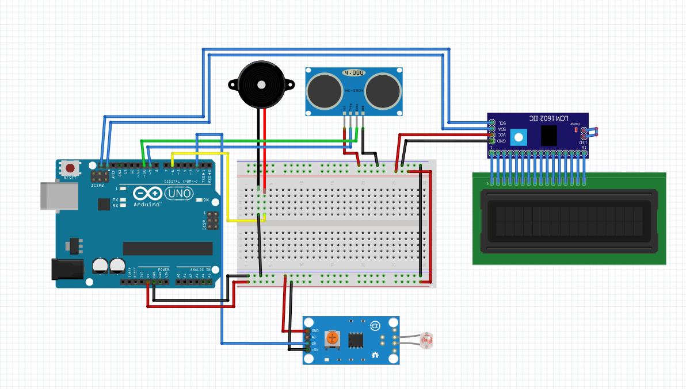

# Buzzer Bicyle Warning System Using Fuzzy Logic

System crated for warning system on electric bike. Controlled by **Arduino Uno** microcontroller. Arduino will take 2 input from 
- HCSR-04 Ultrasonic Sensor
- Infrared Module

HCSR-04 used for to take calculate nearest distance from object ahead of bicycle and Infrared Module used for calculate the speed of the bicycle

So, the input parameter for the system is Distance object ahead and Speed of the bicyle

System using this schematic

---
## Fuzzy Logic

The fuzzy logic on this project based on table below 

The Coloumn reprsent the distance and Row represent the speed. Table show the output of buzzer based on **AND** Condition of the Fuzzy logic from the input.

Membership function of fuzzy login can we see inside the [fuzzyValue](fuzzyValue.h). 

The System using **Mamdami** method to do the fuzzification. And used **Middle of Maxima** (Mean of Max) as it defuzzification method. There's a method to use Average Weight Method. 

